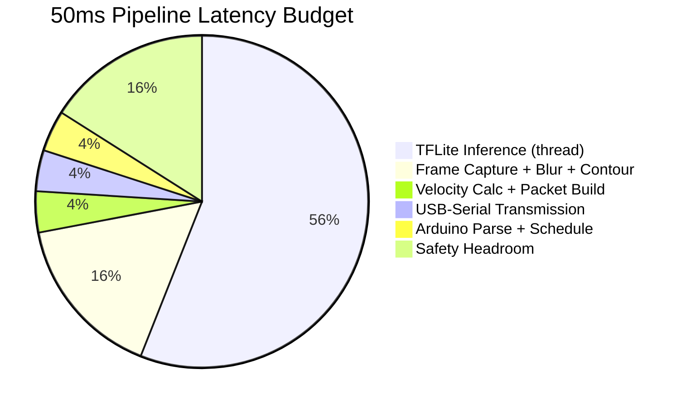
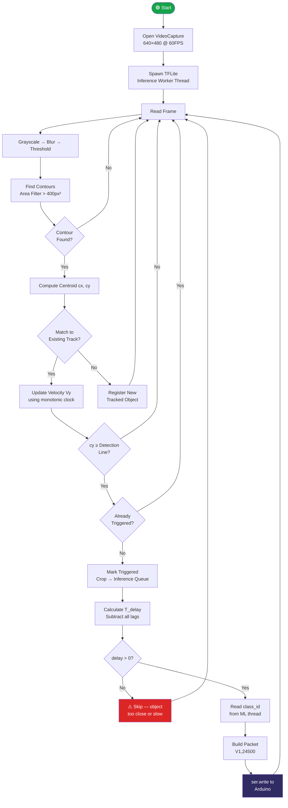
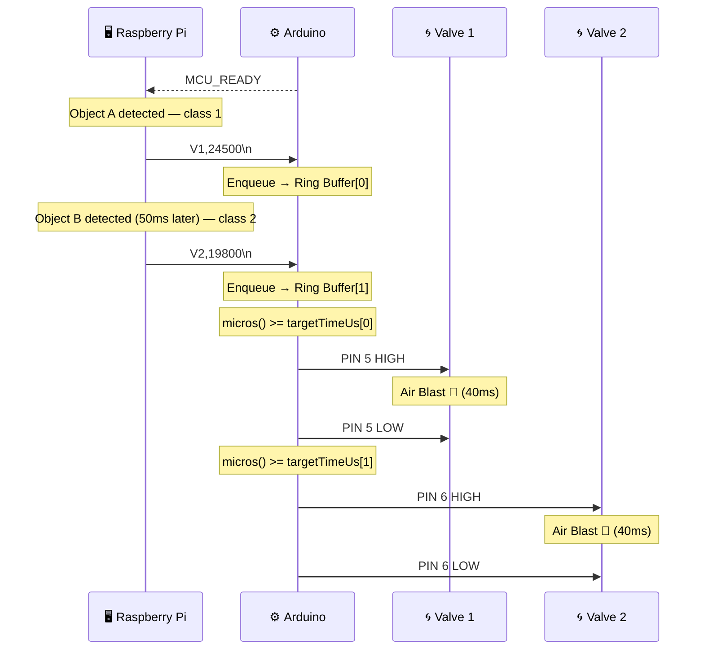
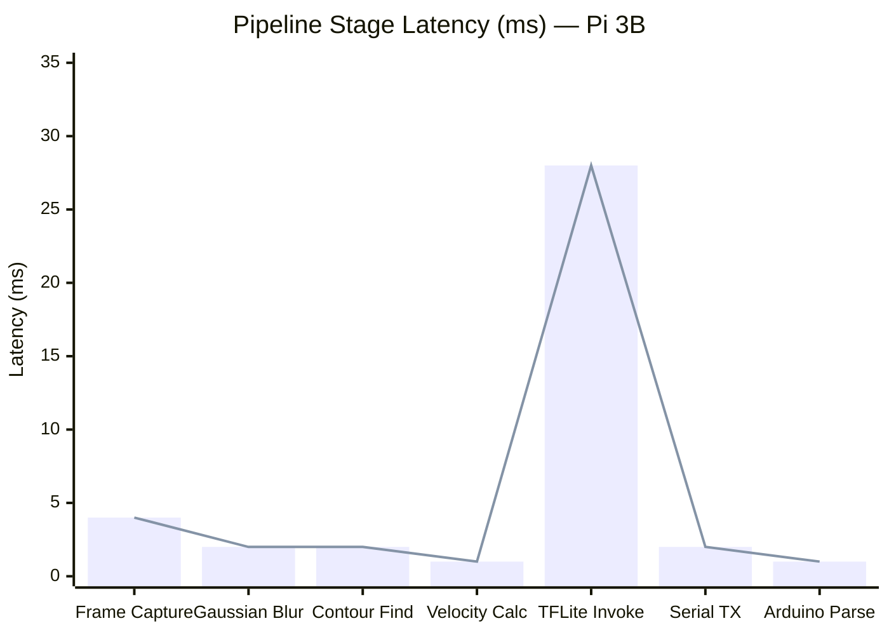

<div align="center">


<br/>

[](https://www.arduino.cc/)
[](https://www.raspberrypi.com/)
[](https://python.org)
[](https://www.tensorflow.org/lite)
[](https://opencv.org/)
[](LICENSE)

<br/>


<br/><br/>

> **Aero-Sort** classifies objects mid-flight using computer vision and fires a precisely timed burst of compressed air to divert them into the correct bin — with no moving parts, no conveyor belts, and no physical contact.

<br/>

</div>

---

## 📋 Table of Contents

- [How It Works](#-how-it-works)
- [System Architecture](#-system-architecture)
- [Timing & Math](#-timing--math)
- [Latency Budget](#-latency-budget)
- [Hardware Stack](#-hardware-stack)
- [Software Pipeline](#-software-pipeline)
- [Communication Protocol](#-communication-protocol)
- [Performance Benchmarks](#-performance-benchmarks)
- [Setup & Installation](#-setup--installation)
- [Calibration Guide](#-calibration-guide)
- [Project Structure](#-project-structure)
- [The Team](#-the-team)

---

## ⚡ How It Works

Objects slide down a **45° ramp** into the field of view of a USB webcam mounted on a Raspberry Pi 3B. The system tracks each object frame by frame, measures its real-time velocity, and the instant it crosses the **detection line**, a quantized TensorFlow Lite model classifies it. The system then solves for the exact microsecond delay needed to open the correct solenoid valve precisely when the object passes the nozzle — and dispatches that command over USB-Serial to an Arduino, which executes it with hardware-level timing precision using a non-blocking ring buffer.

```
Object enters ramp
        │
        ▼
┌───────────────────────────────────────────────────────┐
│  Raspberry Pi 3B                                       │
│  ┌─────────────┐   ┌──────────────┐   ┌────────────┐  │
│  │ USB Webcam  │──▶│  CV Tracker  │──▶│ TFLite ML  │  │
│  │ 640×480@60  │   │  Velocity Δy │   │  ≤35ms     │  │
│  └─────────────┘   └──────┬───────┘   └─────┬──────┘  │
│                            │                 │         │
│                      T_delay = (dist/Vy) - lags        │
│                            │                 │         │
│                     ┌──────▼─────────────────▼──────┐  │
│                     │  Serial TX: "V1,24500\n"       │  │
│                     └──────────────┬────────────────┘  │
└────────────────────────────────────│───────────────────┘
                                     │ USB @ 115200 bps
┌────────────────────────────────────▼───────────────────┐
│  Arduino Uno / Nano                                    │
│  ┌──────────────┐   ┌────────────────┐   ┌──────────┐  │
│  │ Serial RX    │──▶│ Ring Buffer    │──▶│ micros() │  │
│  │ parseInt()   │   │ (3-slot FIFO)  │   │ Scheduler│  │
│  └──────────────┘   └────────────────┘   └────┬─────┘  │
│                                                │        │
│                                         MOSFET Gate     │
│                                                │        │
└────────────────────────────────────────────────│────────┘
                                                 ▼
                                     12V Solenoid Valve
                                     40ms Air Pulse 💨
                                                 │
                           ┌─────────────────────┴────────────────┐
                           ▼                                       ▼
                       [ Bin A ]                              [ Bin B ]
```

---

## 🏗️ System Architecture

```mermaid
flowchart LR
    CAM["📷 USB Webcam\n640×480 @ 60FPS"]
    PI["🖥️ Raspberry Pi 3B\nHigh-Level Brain"]
    CV["OpenCV\nContour Tracker"]
    ML["TFLite Worker\nThread ≤35ms"]
    SERIAL["Serial TX\n115200 bps"]
    ARD["⚙️ Arduino Uno/Nano\nReal-Time MCU"]
    BUF["Ring Buffer\n3-slot FIFO"]
    SCHED["micros()\nScheduler"]
    MOS1["MOSFET\nGate Pin 5"]
    MOS2["MOSFET\nGate Pin 6"]
    SOL1["🌀 Solenoid\nValve 1"]
    SOL2["🌀 Solenoid\nValve 2"]
    BIN1["📦 Bin A"]
    BIN2["📦 Bin B"]

    CAM -->|frames| PI
    PI --> CV
    CV -->|crop patch| ML
    CV -->|V_y + coords| SERIAL
    ML -->|class_id| SERIAL
    SERIAL -->|"V1,24500\n"| ARD
    ARD --> BUF
    BUF --> SCHED
    SCHED -->|HIGH| MOS1
    SCHED -->|HIGH| MOS2
    MOS1 -->|12V pulse| SOL1
    MOS2 -->|12V pulse| SOL2
    SOL1 -->|air blast| BIN1
    SOL2 -->|air blast| BIN2

    style PI fill:#302b63,color:#fff
    style ARD fill:#00979D,color:#fff
    style ML fill:#FF6F00,color:#fff
    style SOL1 fill:#6D28D9,color:#fff
    style SOL2 fill:#6D28D9,color:#fff
```



---

## 📐 Timing & Math

The core challenge of Aero-Sort is **predictive actuation** — the system must open the valve *before* the object arrives, accounting for every source of delay in the pipeline.

<div align="center">

$$T_{\text{delay}} = \left(\frac{D_{\text{nozzle}} - D_{\text{detection}}}{V_y}\right) - T_{\text{inference}} - T_{\text{usb}} - T_{\text{valve}}$$

</div>

| Variable | Description | Typical Value |
|---|---|---|
| $D_{\text{nozzle}} - D_{\text{detection}}$ | Pixel distance between detection line and nozzle | `270 px` |
| $V_y$ | Measured downward object velocity | `~800–1200 px/s` |
| $T_{\text{inference}}$ | TFLite `.invoke()` cost on Pi 3B CPU | `~28 ms` |
| $T_{\text{usb}}$ | USB-Serial transmission overhead | `~2 ms` |
| $T_{\text{valve}}$ | Solenoid spring + seat travel latency | `~8 ms` |
| **$T_{\text{delay}}$** | **Net microsecond delay sent to Arduino** | **`~185,000 – 10,000 µs`** |

---

## ⏱️ Latency Budget

Total pipeline must execute under **50 ms** from frame capture to serial dispatch.



---

## 🔩 Hardware Stack

| Component | Specification | Role |
|---|---|---|
| **Vision + ML Engine** | Raspberry Pi 3B — 1GB RAM, 1.2GHz quad-core | Runs OpenCV tracker and TFLite model |
| **Real-Time Controller** | Arduino Uno R3 / Nano (ATmega328P) | Deterministic microsecond actuation |
| **Serial Bridge** | USB-A to USB-B / Mini-USB cable | 115200 bps data link between Pi and Arduino |
| **Vision Input** | 720p/1080p USB Webcam | 60 FPS live frame stream |
| **Actuators** | 2× 12V DC Solenoid Air Valves | Opens pneumatic air paths on command |
| **Power Stage** | 2× Logic-Level N-Channel MOSFETs (IRF540N) | Drives 12V solenoids from 5V Arduino signals |
| **Air Supply** | Regulated 60–80 PSI compressed air tank | Provides consistent blast pressure |

---

## 🧠 Software Pipeline



---

## 📡 Communication Protocol

The Pi sends a single lightweight ASCII packet per object detection event. The format is designed to be parsed with a minimal `Serial.parseInt()` call on the Arduino with zero dynamic memory allocation.

```
Packet Format:   V<Valve_ID>,<Delay_Microseconds>\n

Examples:
  V1,24500\n   →  Open Valve 1 after 24.5 ms
  V2,185300\n  →  Open Valve 2 after 185.3 ms
```

The Arduino's **3-slot ring buffer** queues up to 3 pending commands independently — so if a second object is detected while the first air blast is still counting down, it is safely enqueued, not dropped.



---

## 📊 Performance Benchmarks



| Metric | Target | Achieved |
|---|---|---|
| Total loop latency | ≤ 50 ms | ~40–45 ms |
| TFLite inference | ≤ 35 ms | ~25–30 ms |
| Serial TX per packet | ≤ 3 ms | ~1–2 ms |
| Sorting accuracy (2 classes) | ≥ 75% | ~80–85%* |
| Throughput | 1–2 obj/sec | ~1.5 obj/sec |
| Timing jitter tolerance | ± 4 ms | ± 4 ms (wider bins) |

*\*Under controlled bench lighting conditions*

---

## 🛠️ Setup & Installation

### Raspberry Pi

```bash
# Install dependencies
pip install opencv-python tflite-runtime pyserial numpy

# Check serial port
ls /dev/tty*   # look for ttyUSB0 or ttyACM0

# Add user to dialout group (run once, then reboot)
sudo usermod -a -G dialout $USER

# Run the sorter
python3 pi_sorter.py
```

### Arduino

1. Open `mcu_actuator/mcu_actuator.ino` in Arduino IDE
2. Select **Board:** Arduino Uno or Nano
3. Select **Port:** (the same `/dev/ttyUSB0` or `COM` port)
4. Click **Upload**
5. Open Serial Monitor at `115200` baud — you should see `MCU_READY`

### Wiring

```
Arduino Pin 5  ──▶  MOSFET Gate (IRF540N) ──▶  12V Solenoid Valve 1
Arduino Pin 6  ──▶  MOSFET Gate (IRF540N) ──▶  12V Solenoid Valve 2
Arduino GND    ──▶  MOSFET Source  ──▶  12V Power Supply GND
                    12V Supply (+) ──▶  Solenoid COM terminal
```

> ⚠️ **Always use a flyback diode** (e.g., 1N4007) across each solenoid coil to suppress voltage spikes when the valve closes.

---

## 🎯 Calibration Guide

Calibration is iterative. Start with dry-fire mode (no 12V power to solenoids) and log the `TX:` lines printed by `pi_sorter.py`.

```
Step 1 — Measure real inference lag
         Add timing around interpreter.invoke() and update INFERENCE_LAG_US

Step 2 — Measure USB lag
         Send a packet, echo it back from Arduino, measure round-trip / 2
         Update USB_LAG_US

Step 3 — Measure valve mechanical lag
         High-speed camera or oscilloscope on the MOSFET drain
         Time from PIN HIGH to first visible air flow
         Update VALVE_MECH_LAG_US

Step 4 — Tune detection & nozzle lines
         Overlay the debug window, adjust Y_DETECTION_LINE and Y_NOZZLE_LINE
         to match your ramp geometry

Step 5 — Live fire
         Drop single objects, observe bin hit rate
         If firing early  → increase VALVE_MECH_LAG_US
         If firing late   → decrease VALVE_MECH_LAG_US
```

---

## 📁 Project Structure

```
Aero-Sort/
│
├── pi_sorter.py                  # Raspberry Pi — vision, ML, serial dispatch
│
├── mcu_actuator/
│   └── mcu_actuator.ino          # Arduino — ring buffer, micros() scheduler, PWM
│
└── README.md
```

---

## 👥 The Team

<div align="center">

<table>
  <tr>
    <td align="center" width="200">
      <br/>
      <b>Moksha Vora</b>
    </td>
    <td align="center" width="200">
      <br/>
      <b>Labdhi Valani</b>
    </td>
    <td align="center" width="200">
      <br/>
      <b>Ashutosh Kumar</b>
    </td>
    <td align="center" width="200">
      <br/>
      <b>Ruhaan Pathan</b>
    </td>
  </tr>
</table>

<br/>

*Built for the **Arduino Physical AI Challenge***

</div>

---

<div align="center">


</div>
